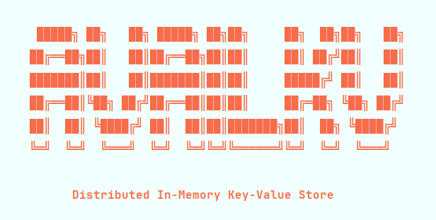

<p align="center">
  
</p>

<p align="center">
  <b>A distributed in-memory key-value store built from scratch in Java & Spring Boot</b><br/>
  Raft-style leader election · WAL durability · AI-assisted diagnostics · Docker orchestration
</p>

<p align="center">
  
  
  
  
  
</p>

---

## What is AvailKV?

AvailKV is a distributed in-memory key-value store built for learning and demonstrating core distributed systems concepts. It implements a Raft-inspired consensus protocol from scratch — no libraries, no shortcuts — on top of Spring Boot, with a full CLI for cluster management, WAL-based crash recovery, and an AI diagnostic layer powered by a local LLM.

It prioritizes **Availability** and **Partition Tolerance** (AP) from the CAP theorem — the cluster keeps serving reads from any alive node even during leader failure, accepting eventual consistency as the tradeoff.

---

## Architecture

```
        ┌─────────────────────────────────────────────────────┐
        │                    Client / CLI                     │
        │              avail.sh / docker-avail.sh             │
        └────────────────────────┬────────────────────────────┘
                                 │ HTTP
                  ┌──────────────┼──────────────┐
                  ▼              ▼              ▼
             ┌─────────┐   ┌─────────┐   ┌─────────┐
             │  node1  │   │  node2  │◄──│  node3  │
             │ LEADER  │──►│FOLLOWER │   │FOLLOWER │
             └────┬────┘   └────┬────┘   └────┬────┘
                  │              │              │
             ┌────▼────┐   ┌────▼────┐   ┌────▼────┐
             │   WAL   │   │   WAL   │   │   WAL   │
             └─────────┘   └─────────┘   └─────────┘
                                 │
                            ┌────▼────┐
                            │ Ollama  │
                            │  Model  │
                            └─────────┘
```

**Write path:** Client → Leader → WAL → Memory → Replicate to followers

**Read path:** Any alive node (leader first, fallback to followers with stale warning)

---

## Core Components

| Component | Responsibility |
|---|---|
| `KVStore` | Thread-safe in-memory storage using `ConcurrentHashMap` |
| `ClusterManager` | Node state machine — term, leader, votes, event log, peer reachability |
| `HeartbeatScheduler` | Sends heartbeats every 2s (leader) / triggers election on timeout (follower) |
| `PeerClient` | OkHttp-based inter-node RPC — heartbeat, vote, replicate |
| `ReplicationService` | Write pipeline — WAL → local apply → fan-out to followers |
| `WALManager` | Appends every mutation to disk, replays on startup for crash recovery |
| `ClusterContext` | Assembles live cluster snapshot into text for LLM consumption |
| `OllamaClient` | Streams prompt + context to local Ollama, parses chunked response |

---

## Features

**Distributed consensus**
- Term-based leader election with majority quorum voting
- Randomised election timeouts (5–8s) to prevent split votes
- Automatic failover when leader becomes unreachable
- Nodes step down immediately on seeing a higher term

**Durability**
- Write-Ahead Log — every mutation logged to disk before applying to memory
- Full WAL replay on node restart — state restored without contacting peers
- Each node maintains its own WAL independently

**AI diagnostics**
- `POST /ask` endpoint accepts natural language questions about the cluster
- `ClusterContext` builds a rich prompt: node states, event history, vote records, peer reachability by name, recent writes
- Strict prompt rules prevent the LLM from hallucinating — answers are grounded in real cluster data

**Cluster management CLI**
- Interactive REPL with session persistence across restarts
- Supports 3 to 11 nodes (odd numbers only for quorum)
- Two modes: local (`avail.sh`) and Docker (`docker-avail.sh`)
- Docker compose file generated dynamically based on chosen node count

---

## Getting Started

### Local mode

```bash
# Build the JAR
mvn clean package -DskipTests

# Start the cluster
bash avail.sh
```

The script asks for node count (3 / 5 / 7 / 9 / 11), starts all nodes as background processes, waits for them to be healthy, and drops into the REPL.

### Docker mode

```bash
# Start the cluster
bash docker-avail.sh

# Pull the Ollama model (first time only — persists across restarts)
docker exec -it availkv-ollama ollama pull gemma2:2b
```

The script generates `docker-compose.generated.yml` dynamically, builds the image, and starts all containers.

---

## CLI Commands

```
PUT key=value         Write a key to the leader
GET key               Read — tries leader first, falls back to any alive node
DELETE key            Delete a key via the leader
SYSTEMSTATUS          Show all nodes with roles and up/down status
LISTALL               Print full WAL — leader first, fallback to alive follower
LEADER                Show current leader, term, and URL
KILL <n>              Kill node n  (e.g. KILL 2)
KILL LEADER           Kill whichever node is currently leader
KILL ALL              Kill all nodes
RESTART <n>           Restart node n
AI <question>         Ask the leader an AI diagnostic question
AI <n> <question>     Ask node n specifically
LOGS <n>              Show last 50 log lines from node n  (Docker mode only)
HELP                  Show all commands
EXIT                  Prompts to persist state or reset everything
```

---

## AI Diagnostics

The `/ask` endpoint accepts plain-text questions and answers using live cluster state as context. The LLM never speculates — answers are grounded strictly in what the cluster actually knows.

```bash
availkv> AI Is the cluster healthy right now?
availkv> AI Why did the last election happen?
availkv> AI Who voted for the current leader?
availkv> AI What is the status of node2?
availkv> AI 3 What does this node know about the cluster?
```

Context fed to the LLM includes: node identity and state, current term, leader, peer reachability by node name, vote records per term, recent WAL entries, cluster event history (elections, step-downs, vote grants/rejections), and explicit pre-computed facts so the model doesn't have to infer from raw data.

---

## CAP Theorem

AvailKV is an **AP system** — it prioritises Availability and Partition Tolerance over Strong Consistency.

- **Reads** are served from any alive node, including followers with potentially stale data
- **Writes** go through the leader only, replicated to followers asynchronously (fire-and-forget)
- **During a partition**, the majority partition elects a new leader and keeps serving — the minority partition becomes read-only
- **Data converges** once nodes reconnect and WALs are replayed — making this an eventually consistent AP system


---

## Tech Stack

- **Java 21** + **Spring Boot 3.2** — REST API, scheduling, dependency injection
- **OkHttp** — inter-node HTTP communication
- **Jackson** — JSON serialization
- **Ollama** + **gemma2:2b** — local LLM for AI diagnostics
- **Docker** + **Docker Compose** — containerized multi-node deployment
- **Shell (Bash)** — cluster management CLI

---

<p align="center">Built for learning distributed systems concepts — one phase at a time.</p>